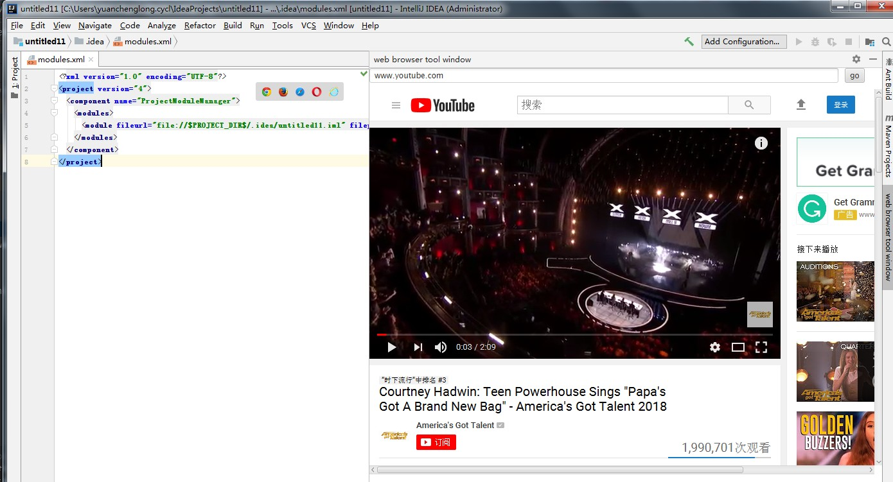
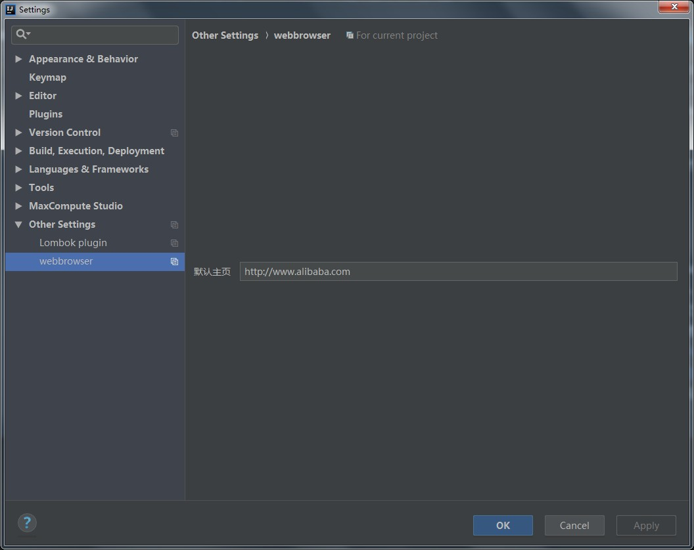

话不多说先上效果

是不是很棒，边写代码边看教(zhui)程(ju)。工作学习两不误

###怎么安装
1. 下载插件[webbrowser](webbrowser-0.0.1.zip)
2. 安装插件 

3. 重启idea，然后你就可以发现插件了

>  Mac：IntelliJ IDEA -> Preferences -> Plugins;

>  Windows：File -> Settings -> Plugins.

>  install plugin from disk

> 注意下:有的mac下载后会解压出来。不要选解压的，安装的是webbrowser-0.0.1.zip这个文件

###  设置默认主页
在idea的settings/Preferences 有webbrowser的配置项，可以配置默认主页

###  原理

  原理就是Idea Plugin+JavaFX中的WebEngine。

### bug
目前还有很多bug，最严重的是可能有时候关闭之后就无法打开了。定位好长时间还没没解决，所以分享出来和大家一起解决。
